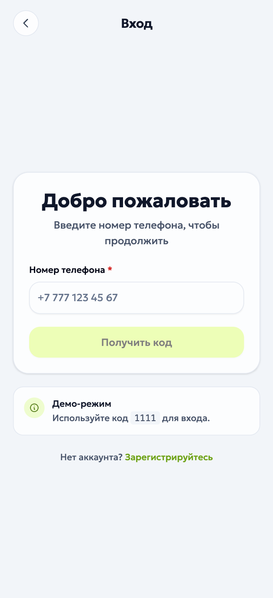
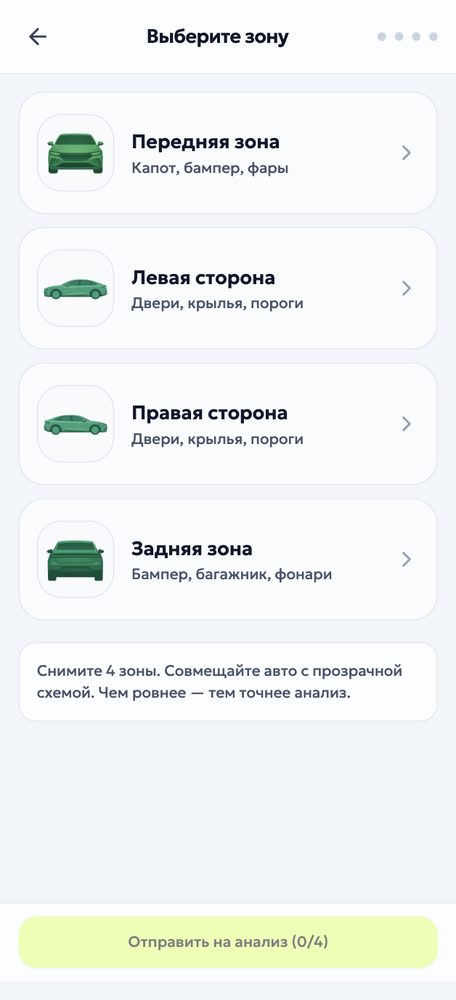
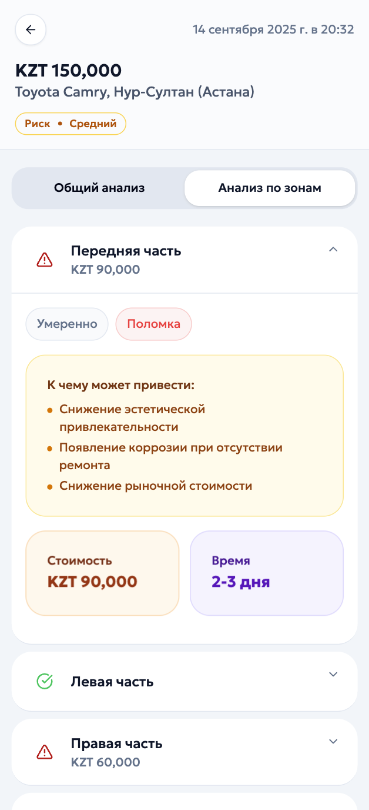
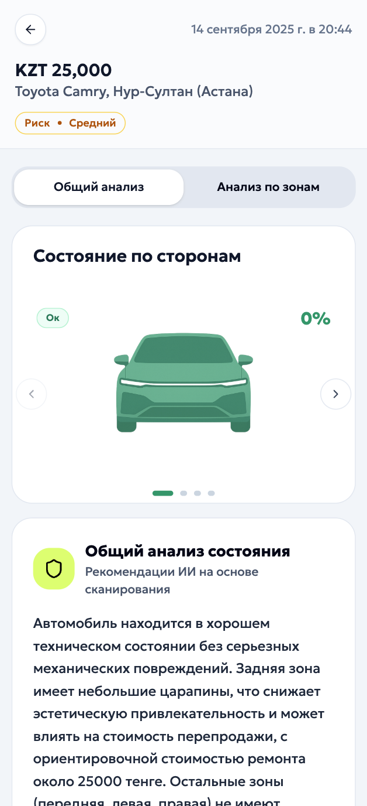

# Altai CarScan

### Описание Проекта

**Altai CarScan** — это инновационное веб-приложение, разработанное для диагностики и анализа состояния автомобилей с использованием технологий машинного обучения. Проект позволяет пользователям сканировать свой автомобиль с помощью мобильного устройства, а затем получать подробные отчеты об обнаруженных проблемах. Приложение состоит из трех ключевых частей: современного фронтенда, надежного бэкенда и мощной модели машинного обучения, размещенной на облачной платформе.

### Скриншоты Интерфейса

#### 1. Приветственная страница


#### 2. Страница входа



#### 3. Главная страница


#### 4. Страница сканирования



#### 5. Список анализов


#### 6. Детали анализа





### Как запустить модель

Модель машинного обучения, являющаяся основой Altai CarScan, размещена на платформе [Modal Labs](https://modal.com/ "null"). Она отвечает за обработку изображений, полученных во время сканирования, и за точное определение потенциальных проблем с автомобилем.

Эндпоинт модели:

`https://maulerrr--indrive-quality-analyze-bytes.modal.run`

Пример запроса

```
    POST raw bytes (image/jpeg or application/octet-stream) to the root of the endpoint host.
    curl --http1.1 -X POST -H "Content-Type: application/octet-stream" \
      --data-binary @example.jpg "https://maulerrr--indrive-quality-analyze-bytes.modal.run"

    POST multipart/form-data with field 'file' to the root of this endpoint host.
    curl --http1.1 -X POST -F "file=@example.jpg" "https://maulerrr--indrive-quality-analyze-bytes.modal.run"
```

### Как Запустить Проект

Для запуска проекта убедитесь, что у вас установлен [Bun](https://bun.sh/ "null").

#### Фронтенд

1. Перейдите в папку frontend.
2. Создайте файл <span class="selected">.env</span>`, используя пример `.env.example`.
3. **Установите зависимости:**
   ```
   bun install

   ```
4. **Запустите сервер разработки:**
   ```
   bun run dev

   ```

#### Бэкенд

1. Перейдите в папку backend.
2. Создайте файл .env`, используя пример `.env.example`.
3. **Для интеграции с базой данных PostgreSQL используйте Prisma. Выполните следующие команды:**
   ```
   bun run prisma:generate
   bun run prisma:migrate

   ```
4. **Запустите сервер разработки:**
   ```
   bun run dev

   ```

**Примечание:** Для корректной работы приложения убедитесь, что ваша база данных PostgreSQL настроена и доступна.
